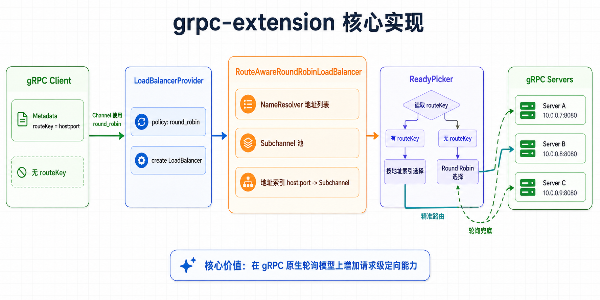

# gRPC扩展：路由感知负载均衡器

[](https://opensource.org/licenses/Apache-2.0)
[](https://search.maven.org/artifact/io.github.bridgewares/grpc-extension)
[](https://github.com/bridgewares/grpc-extension)



一个用于gRPC的Java扩展，实现了基于请求头的路由感知负载均衡。此扩展通过允许客户端使用`routeKey`头部将请求路由到特定服务器，同时保持轮询回退行为，增强了gRPC的默认负载均衡功能。

## 功能特性

- **路由感知负载均衡**：基于`routeKey`头部将请求路由到特定服务器
- **轮询回退**：当未指定`routeKey`时默认使用轮询负载均衡
- **优雅降级**：当`routeKey`中指定的服务器不可用时回退到轮询
- **IPv4/IPv6支持**：支持路由键中的IPv4和IPv6地址格式
- **无缝集成**：可作为gRPC默认负载均衡器的即插即用替换

## 架构说明

此扩展实现了一个自定义的gRPC `LoadBalancer`，它扩展了标准的轮询负载均衡器，并添加了路由功能：

- **RouteAwareRoundRobinLoadBalancer**：主要的负载均衡器实现，处理路由感知和轮询选择
- **RouteAwareLoadBalancerProvider**：负载均衡器提供者，用于注册和创建负载均衡器实例
- **ReadyPicker**：根据路由键或轮询策略选择子通道
- **EmptyPicker**：处理没有合适子通道的情况

## 构建和安装

### 前置要求

- Java 17或更高版本
- Maven 3.6或更高版本

### 从源码构建

```bash
git clone https://github.com/bridgewares/grpc-extension.git
cd grpc-extension
mvn clean install
```

### Maven依赖

将以下依赖添加到您的`pom.xml`中：

```xml
<dependency>
    <groupId>io.github.bridgewares</groupId>
    <artifactId>grpc-extension</artifactId>
    <version>0.0.1</version>
</dependency>
```

## 使用方法

### 配置

要使用此负载均衡器，您需要在gRPC通道构建器中配置它：

```java
import io.grpc.LoadBalancerRegistry;
import io.grpc.loadbalance.RouteAwareLoadBalancerProvider;

// 注册自定义负载均衡器（如果需要手动注册）
LoadBalancerRegistry.getDefaultRegistry()
    .register(new RouteAwareLoadBalancerProvider());

// 使用它在通道构建器中
ManagedChannel channel = ManagedChannelBuilder.forTarget("your-service")
    .defaultLoadBalancingPolicy("round_robin")  // 使用round_robin策略会自动使用我们的实现
    .build();
```

### 路由键格式

`routeKey`头部应为`host:port`或`[ipv6]:port`格式：

- **IPv4**：`192.168.1.1:8080`
- **IPv6**：`[::1]:8080`

### 使用示例

#### 使用路由键

```java
// 创建带有路由键的头部
Metadata headers = new Metadata();
headers.put(Metadata.Key.of("routeKey", Metadata.ASCII_STRING_MARSHALLER), "192.168.1.1:8080");

// 使用路由键发送请求
responseStub.yourMethod(request, headers);
```

#### 不使用路由键（轮询）

```java
// 不使用路由键发送请求 - 使用轮询
responseStub.yourMethod(request);
```

## 路由逻辑

负载均衡器遵循以下路由逻辑：

1. **检查路由键**：如果请求包含有效的`routeKey`头部：
   - 从路由键解析主机和端口
   - 尝试路由到指定的服务器
   - 如果服务器可用，将请求路由到那里
   - 如果服务器不可用，回退到轮询

2. **无路由键**：如果未提供`routeKey`：
   - 在所有可用服务器上使用标准轮询负载均衡

3. **错误处理**：
   - 无效的路由键格式返回`INVALID_ARGUMENT`状态
   - 不存在的服务器返回`NOT_FOUND`状态
   - 网络错误被优雅处理，回退到轮询

## 项目结构

```
grpc-extension/
├── src/main/java/io/grpc/loadbalance/
│   ├── RouteAwareRoundRobinLoadBalancer.java    # 主要负载均衡实现
│   └── RouteAwareLoadBalancerProvider.java       # 负载均衡器提供者
├── pom.xml
├── README.md                                   # 中文版本（本文件）
└── README.en.md                                # 英文版本
```

## 开发和贡献

### 贡献指南

1. Fork此仓库
2. 创建功能分支
3. 进行您的更改
4. 为新功能添加测试
5. 提交pull request

### 测试

使用Maven运行测试：

```bash
mvn test
```

## 版本历史

- **0.0.1** - 初始版本，包含路由感知轮询负载均衡功能

## 许可证

本项目采用Apache许可证2.0版本。请参阅[LICENSE](LICENSE)文件了解详情。

## 致谢

- 基于gRPC框架构建
- 受微服务架构中更灵活负载均衡策略需求的启发
- 感谢gRPC社区提供的优秀框架和文档

---

**[English Version](./README.EN.md)** | 中文版本